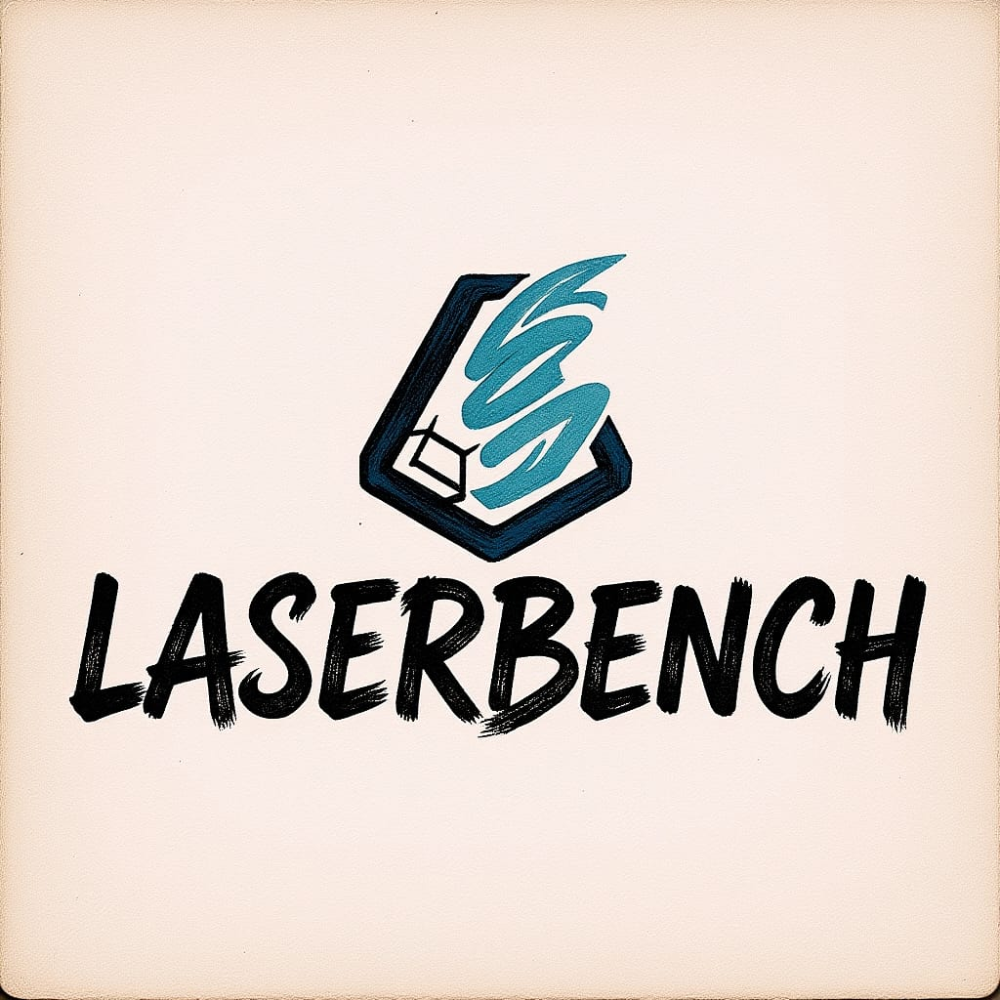
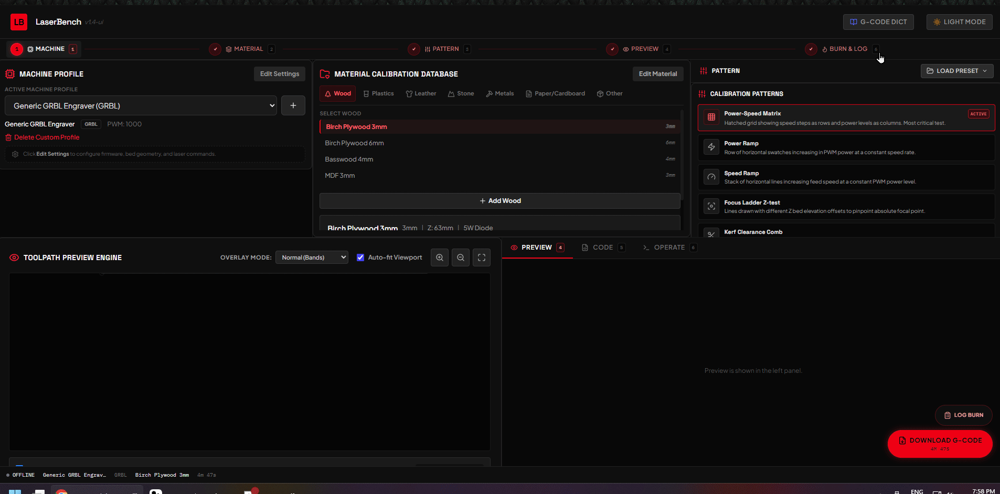
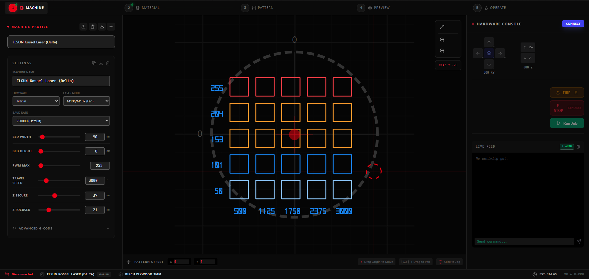
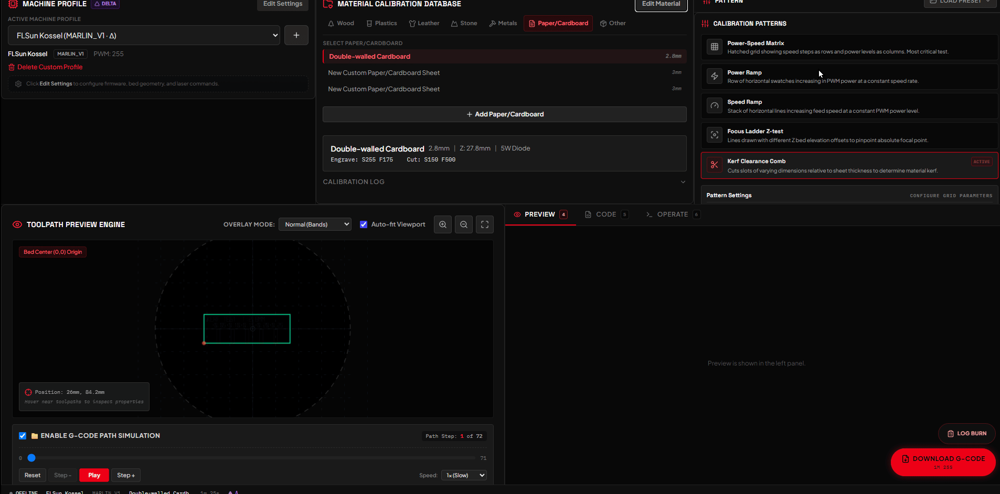

# LaserBench



A web-based laser cutter control interface with G-code generation, SVG toolpath pre-visualization, serial communication, and a real-time printer console.



## Features




### Core Functionality
- **Calibration Pattern Generator**: Power-Speed Matrix, Power Ramp, Speed Ramp, Focus Ladder, and Kerf Clearance Comb patterns
- **Delta Kinematics Validation**: Pre-flight reachability checks for delta/SCARA machines — patterns are validated against your configured print radius before G-code is generated
- **SVG Toolpath Visualizer**: Interactive pan/zoom canvas with G-code simulation playback, power/speed heatmap overlays, and coordinate inspection
- **G-Code Generator**: Firmware-aware output for GRBL and Marlin with automatic laser on/off and Z-axis management
- **Serial Communication**: Connect to laser cutters via Web Serial API (Chrome/Edge) with baud rate selection (250000, 230400, 115200, 57600, 9600)
- **Real-time Printer Console**: Live feed with manual command input, jog controls, fire test, and emergency stop
- **Material Database**: Per-material calibration history logs with optimal power/speed/Z records
- **Machine Profiles**: Support for rectangular and circular (delta) beds, GRBL and Marlin firmware
- **Generator Presets**: Save and recall full parameter snapshots; ships with factory presets for common materials
- **G-Code Dictionary**: In-app reference for all common G/M codes with syntax, examples, and compatibility notes
- **Dark / Light Theme**: Toggle between elegant dark and high-contrast light modes

### Advanced Features
- **Keyboard Shortcuts**: Ctrl+Esc (E-STOP), Esc (abort print), H (home), F (hold to fire), arrow keys (jog XY), C (connect/disconnect)
- **Auto-Scroll Console**: Scroll up to pause auto-scroll, click badge to toggle
- **Movement Mode Tracking**: Absolute/Incremental badge in StatusBar
- **G-Code File Upload**: Import `.gcode`, `.nc`, or `.gc` files with parser
- **Inline G-Code Editing**: Edit generated G-code with pencil/check/cancel/reset buttons
- **Profile Import/Export**: Versioned JSON envelope with id-based dedup on import
- **Clipboard Copy/Paste**: Copy/paste machine and material profiles via clipboard for easy sharing
- **Modular Console**: Extracted JogControls, FireControls, and SerialLog subcomponents
- **Pointer Events**: SVG canvas supports touch/pen/stylus input via pointer events
- **Onboarding Tooltips**: 5-step walkthrough with localStorage persistence

#### Security & Performance
- **Content Security Policy**: CSP meta tag in index.html
- **Input Sanitization**: Control character removal, dangerous command blocking
- **Ring Buffer**: O(1) serial message storage (500 messages) replacing array spread
- **Numeric Input Debounce**: 200ms delay on blur/Enter to prevent lag
- **SVG Wheel Throttle**: 50ms cooldown on zoom operations
- **Conditional Analytics**: Vercel analytics loaded only when `VERCEL=1`
- **TypeScript Strict Mode**: `strict: true` in tsconfig.json for stronger type safety



## Delta Kinematics

LaserBench validates Cartesian coordinates against your delta's reachable print radius **before** generating G-code. Firmware (Marlin/GRBL) handles actual inverse kinematics at runtime; LaserBench just warns you when a pattern would fall outside the printable zone so you can adjust block size or step count.

**To enable:**
1. Open a machine profile → click **Edit Settings**
2. Check **Enable Delta Kinematics Validation**
3. Fill in your machine's measured parameters:
   - **Delta Radius**: horizontal center-to-tower distance (mm)
   - **Print Radius**: max reachable radius from bed center (mm)
   - **Rod Length**: diagonal rod dimensions (mm)
   - **Tower Angle Offset**: rotational correction if towers aren't at standard 210°/330°/90°

The FLSUN Kossel preset ships with delta kinematics enabled and sensible defaults (R=105.6mm, print radius=85mm).

## Keyboard Shortcuts

| Key | Action |
|-----|--------|
| `Ctrl+Esc` | Emergency Stop (E-STOP) |
| `Esc` | Abort print |
| `H` | Home machine |
| `F` (hold) | Fire laser at 30% power |
| `←` / `→` | Jog X ±10mm |
| `↑` / `↓` | Jog Y ±10mm |
| `C` | Connect/disconnect serial |

## Prerequisites

- Node.js v18 or higher
- Chrome, Edge, or Opera (Web Serial API required for printer connection)
- Laser cutter with USB/serial connection

## Installation

```bash
git clone https://github.com/TheRealFredP3D/LaserBench.git
cd LaserBench
pnpm install
pnpm run dev
```

Open `http://localhost:3000` in Chrome or Edge.

## Usage

1. **Select Machine Profile** — choose or create a profile matching your laser cutter
2. **Select Material** — pick a material sheet and review saved calibration logs
3. **Choose Pattern** — configure a calibration pattern and its parameters
4. **Preview** — inspect the toolpath in the SVG visualizer; watch for delta warnings
5. **Generate & Download** — download the `.gcode` file or stream it directly via serial
6. **Log Results** — after burning, record optimal settings in the material's calibration log

## Manual Controls (Serial Connected)

- **Jog XY / Z**: move the laser head in 10mm / 5mm increments
- **Fire (30%)**: hold to pulse laser at 30% power for focus alignment
- **E-STOP**: sends `M112` — immediate hardware halt
- **Manual Command**: type any G/M code and send directly

## Building for Production

```bash
pnpm run build
```

Output goes to `dist/`.

## Testing

```bash
pnpm run test
```

198 tests across 19 files covering G-code generation, parsing, time estimation, material validation, and component rendering.

## Docker

```bash
docker build -t laserbench .
docker run -p 3000:80 laserbench
```

## Browser Compatibility

Web Serial API is required for printer connection:

| Browser | Supported |
|---------|-----------|
| Chrome 89+ | ✅ |
| Edge 89+ | ✅ |
| Opera 75+ | ✅ |
| Firefox | ❌ |
| Safari | ❌ |

## License

MIT License — see [LICENSE](LICENSE) for details.
